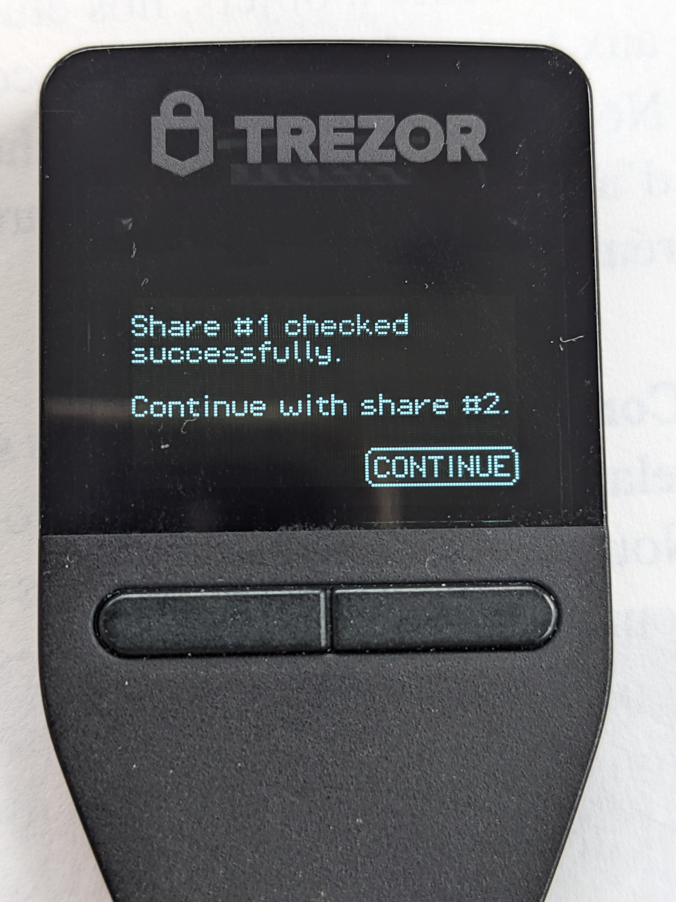

# MoneroKon Cryptocurrency Funds Management Policy

Organizing MoneroKon requires collecting, holding and spending funds. Funds may be held in various cryptocurrencies and in fiat in a bank account belonging to the Twisted Edwards z.s., a non profit organization.

The traditional bank account is out of scope of this document which aims at defining how funds held in cryptocurrencies are managed.

# Cryptocurrencies

While it could be logical to think that all funds used to organize MoneroKon should be held in XMR, the fact that some suppliers must be paid long after their quotes were issued and approved requires that the volatility exposure of part of the funds be reduced. For that matter, the funds are split between multiple cryptocurrencies, mostly XMR and stablecoins.

The funds held are therefore managed on multiple blockchains and as such require diverse setups when it comes to controlling and ensuring their safety.

# Situation at the beginning of 2025

## Monero

Until the end of 2024, Rino was used to hold the XMR for MoneroKon. This service, unfortunately now defunct, offered an easy way to manage multiple approvals for spendings through the use of a user friendly web interface.

The closing of Rino at the end of October 2024 had the organizers decide to move the funds to another wallet. The user experience with Monero native multisig wallets, which was experimented earlier in 2024 did not convince the organizers that the technology was mature enough to use for managing the MoneroKon funds. The process was deemed error prone and cumbersome when it comes to signing transactions.

The decision was then made to move the funds to a standard wallet whose secret key was stored in a [Ledger](https://ledger.com) hardware wallet belonging to `ajs`.

Conscious that the situation was not ideal, `ajs` expressed willingness to have a different set up so anything happening to him would not jeoperdize MoneroKon funds.

It has therefore been decided in January 2025 that a new wallet would be created using a [Trezor](https://trezor.io) hardware wallet with a seed phrase backup using Shamir Secret Sharing Scheme as per [SLIP39](https://content.trezor.io/slip39).

As this new wallet will be generated by `ajs`, the generation will initially not be trustless. A trusted set up procedure is suggested below.

## EVM based coins

Stablecoins held by MoneroKon are ERC-20 tokens on an EVM compatible blockchain. Those coins are not held by an EOA (Externally Owned Address) but through a [Safe](https://safe.global) smart contract with a multisig of 2/3.

The current Safe exists on the Polygon blockchain. The signers are `ajs`, `comrad` and `siren`.

The use of the Safe multisig mechanism has proved satisfactory and is planned to be retained.

# Plan moving forward

The EVM based coins are managed using a mechanism providing a level of safety deemed satisfactory, therefore no change is planned for those funds.

On the other hand, the way funds held in XMR are currently managed is not offering enough safety guarantees and should be changed to ensure the availability of the funds does not depend on a single individual.

The urgency is to move funds to a wallet which can be recovered among the MoneroKon organizers. This is described in the section *Trusted setup of Trezor device*.

In a second phase, the funds could be split between a *cold* Monero wallet using multisig, and a *hot* Monero wallet requiring approval of a single user.

As already mentioned, the current Monero multisig is not ideal for managing funds which may require frequent transactions to be issued. Therefore a new test setup should be experimented among MoneroKon organizers to get acquainted with the process of signing transactions to ensure funds can be moved to the *hot* wallet in a timely manner when needed.

Also note that Monero multisig wallets cannot rely on hardware wallets for the storage of their keys, the security guarantees are therefore lower.

The *hot* wallet in that second phase should be accessible to multiple organizers, the section *Trustless setup of Trezor device* aims at defining how this can be achieved without revealing the seed phrase to a single individual.

As the safety of the MoneroKon funds will be in the hands of multiple people with a potential threshold which must be met for accessing them, a process for providing periodic Proof of Life should be defined and followed in order to address the situation where a signer would have gone dark.

## Trusted setup of Trezor device

The *trusted* setup of Trezor device is the procedure to follow to ensure that the funds currently managed by `ajs` can rapidly be moved to a wallet whose seed can be recovered by other MoneroKon organizers.

The procedure will be followed by `ajs` who will at one point be in posession of all the information needed to recover the new wallet seed, hence the *trusted* name of the procedure.

The procedure to follow is rather straightforward, the Trezor device should be initialized with a new seed with a *shamir* backup (as called by Trezor). During initialization, the number of shares (**N**) and the threshold (**K**) will be selected. The words (20 or 33 depending if the seed is 128 or 256 bits) of each share will then be shown and should be written down.

Note that the Trezor initialization performs a check which only verifies a few words from each share. In order to ensure that shares were written correctly, it is advized to perform multiple full recoveries of the Trezor device involving all shares to ensure that they were correctly written down.

Once shares have been checked and verified, they can be encrypted using GPG, each for their associated recipient. The key id of the recipients should be hidden (`--throw-keyids`) in the encryption process. The cleartext shares should be signed by the party conducting the trusted setup by generating a **detached signature**. This will ensure that the origin can be verified but will not bloat the encrypted share size. The encrypted shares should not be armored in order to reduce their size.

Encrypted shares and associated signatures should then be transmitted to each recipient via a secure channel (*matrix DM*, *SimpleX chat*, *signal*). The recipient should ensure that the content can be decrypted and verify the signature. The encrypted shares should then be stored in a safe place. The size of the encrypted shares should be small enough to allow to print them on a QR code to store them on paper form.

After the execution of this procedure, a single Trezor device will have been set up with a new seed, and that seed will have been dispatched among **N** MoneroKon organizers, with any **K** of them able to recover the seed by combining their shares thus ensuring access to the funds as long as **K** shares are available.

## Trustless setup of Trezor devices

The *trusted* setup described above ensures that the seed for the newly created wallet can be recovered by combining **K** shares but only allows a single user to control the funds.

The procedure described in this section aims at initializing a single new wallet on multiple Trezor devices, without having a single person know the seed at any one time. This allows for multiple persons to control the funds, each using a Trezor device initialized during the procedure, but does not enable any holder of one of those devices to clone the wallet on a new device.

This procedure requires that all participants be physically present in the same room during the procedure. It also requires that each participant has a Trezor device (either Trezor 3 or Trezor 5) which will be dedicated to managing MoneroKon funds.

The procedure also requires access to a laptop running Tails to perform parts of the procedure using the [`trezorctl`](https://trezor.io/learn/a/using-trezorctl-commands) utility.

The steps of the procedure are described below.

### 1 - Authenticate, wipe and identify the Trezor devices

The Trezor devices used during the procedure should be authenticated and wiped prior to being used.

Note that only [Trezor Safe 3](https://trezor.io/trezor-safe-3) and [Trezor Safe 5](https://trezor.io/trezor-safe-5) devices must be used as they are the only ones offered by Trezor with a Secure Element.

#### Authenticate

Authentication of a Trezor device is performed using the following command from a laptop **connected to the Internet**:

```
trezorctl device authenticate
```

The response should look like:

```
[OK] Challenge verified successfully.
[OK] Device certificate verified successfully: CN=T3T1 Trezor Safe 5
[OK] CA #1 certificate verified successfully: CN=Trezor Manufacturing CA,O=Trezor Company s.r.o.,C=CZ
[OK] Successfully verified a Trezor Safe 5 manufactured by Trezor Company.
```

For the rest of the procedure, the laptop must be put offline.

#### Wipe

The Trezor devices must be wiped using the following command:

```
trezorctl device wipe
```

#### Identify

The device Id of the devices used during the procedure should be retrieved using:

```
trezorctl get-features
```

Those Ids should be kept track of to ensure for example that a device handed back by a participant is indeed one that participated to the original setup as a new device id is generated each time a device is setup from seed.

### 2 - Initialize the wallet

Once all devices have been authenticated, wiped and identified, one device should be selected at random to generate the new seed.

The initialization must be done using the following command:

```
trezorctl device setup -t 128 -b shamir -r -p
```

The `-r` option instructs the Trezor to ask for a passphrase when accessing the device, `-p` instructs it to ask the user to set a PIN, `-b` sets the backup type to *Shamir* and `-t 128` is the size of the generated entropy. The bit length of entropy can be either 128 or 256 bits. An entropy of 128 bits will lead to Shamir shares of 20 words while 256 bits of entropy will produce shares of 33 words.

The seed backup phase of the wallet creation will ask the user to choose the number of shares to generate and set the threshold of the number of shares needed to recover the seed. The device will then display the shares one after the other. For each share the device will check that the words were correctly written down by asking the user to enter a few random words from each share.

As the shares are displayed in order, the trustless procedure works by having a different person read and interact with the device for each share, carefully writing the share words down on paper. The device is passed from user to user when the following message appears:



### 3 - Setup of additional Trezor devices

Once all shares have been displayed and written down, additional Trezor devices can be setup by issuing the following command:

```
trezorctl device recover -p -r
```

The device will ask the number of words in each share, either 20 or 33. Then it will ask to enter shares until the threshold is met.

A random set of users equal to the threshold should each enter their share into the device being set up.

### 4 - Harden the Trezor devices configuration

In order to ensure that the PIN and passphrase are always entered on the device itself, the following commands should be executed for each connected device.

```
# Force the passphrase to be entered on the Trezor device itself
trezorctl set passphrase on --force-on-device
# Enforce strict safety checks
trezorctl set safety-checks strict
# Force use of PIN
trezorctl set pin on
# Force setting of a PIN code which will trigger the wiping of the device
trezorctl set wipe-code
```

Whether or not a passphrase should be used can now be decided among the participants. If a passphrase is *NOT* used, the `-r` options in previous `trezorctl` commands can be omitted.

### 5 - Verify the recovered seed

In order to ensure that all devices were set up with the same seed, issue the following command and compare the returned Monero addresses, they should all match.

```
trezorctl monero get-address -n m/44h/128h/0h
```

### 6 - Done!

That's it, there are now multiple devices configured with the same seed without any single party knowing the seed or having enough information to recover it.

## Proof of Life

Periodic *Proof of Life* attestations aim at ensuring that the various parties who may be needed to access the MoneroKon funds are indeed in that capacity. Should any party not provide its *Proof of Life*, measures should be taken to either replace that party as a Safe signer, or generate a new seed in either a *trusted* or *trustless* manner, depending on feasibility, to ensure a sufficent safety margin in the number of shares in circulation.

The materialization of the *Proof of Life* varies based on the role assumed by the party required to provide the attestation.

### Safe signers

The *Proof of Life* of Safe signers aims at ensuring that they still have access to the secret key defined as a signer of the Safe.

An easy way to prove this is to publicly sign a message with the given key. This can easily be done using the [Etherscan Verified Signature Service](https://etherscan.io/verifiedSignatures).

The signed message should attest the signature was generated recently, as such a recent Monero block number and associated block hash should be used as the message.

Signatures could be published on the Etherscan service or simply circulated among the MoneroKon organizers.

### Holders of shares from the trusted setup of the Trezor device

In that case the goal of the *Proof of Life* is to ensure that the party still has access to the private key which can decrypt the Shamir backup share it holds.

The holder should therefore sign a message with that key, message which should contain a recent Monero block number and associated hash in order to prove that the signature was done recently.

Note that this attestation does not guarantee that the share is still available to the user, only that they still have access to the GPG key. This is a known weakness and there doesn't seem to be an easy way to circumvent it except by setting up a new Trezor device when participants are all physically present together.

### Holders of Trezor devices configured during the trustless setup

Holders of those Trezor devices should sign a message with the main address of the Monero wallet using Feather wallet or the Monero CLI. Again that message should contain a recent Monero block number and hash.

This *Proof of Life* guarantees that the holder still has access to a configured Trezor device.

Unfortunately, due to the nature of the trustless setup, there is no way to ensure that the holder still has access to the Shamir share. The only way this could be ensured is by reconfiguring a new Trezor device. This can only be done with participants physically present together.
